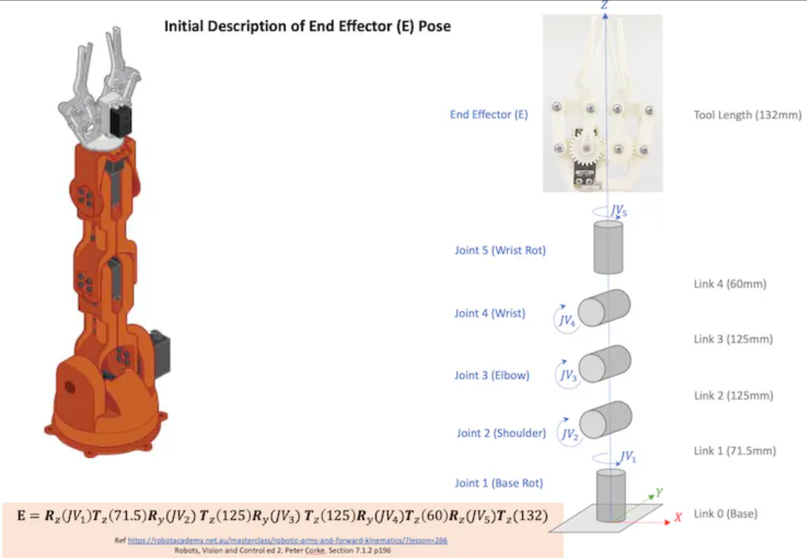
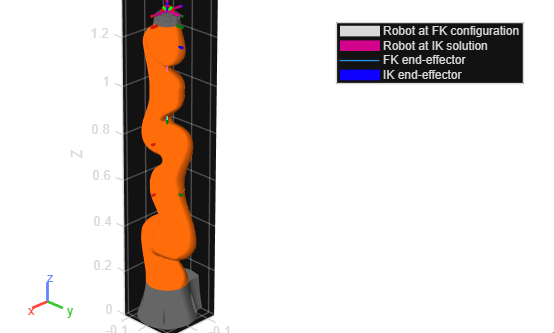

# Robotic Arm Modeling using Forward and Inverse Kinematics (MATLAB & Simulink)

## Overview

This project presents the modeling and simulation of a robotic manipulator developed as part of the **Automation & Control Laboratory (A&C Lab)** core module at **RPTU Kaiserslautern-Landau**.

The objective of the project was to compute the end-effector position from given joint variables using **forward kinematics**, and determine the required joint configurations for a desired end-effector position using **inverse kinematics**.

The implementation demonstrates transformation-based kinematic modeling and simulation of robotic arm motion using MATLAB and Simulink.

---

## Project Context

This project was completed as part of a **team of four students** during the Automation & Control Laboratory course.

The lab focused on modeling robotic manipulator motion using homogeneous transformation matrices and validating the results through simulation in MATLAB/Simulink.

This repository presents the modeling workflow and simulation structure used in the project.

---

## Repository Structure

```
robotic-arm-kinematics-matlab/
│
├── models/
│   ├── forward_kinematics_model.slx
│   └── inverse_kinematics_model.slx
│
├── scripts/
│   └── robotic_arm_analysis.mlx
│
├── docs/
│   └── robot_structure.png
│
└── results/
    └── fk_ik_solution_visualization.png
```

---

## Manipulator Structure

The robotic manipulator consists of five revolute joints forming a serial kinematic chain. The pose of the end-effector is obtained using a sequence of homogeneous transformation matrices between consecutive coordinate frames attached to each joint.

The structure of the manipulator and the transformation sequence used for modeling are illustrated below:



---

## Forward Kinematics

Forward kinematics computes the end-effector pose from known joint parameters.

In this project:

• joint variables are provided as system inputs
• transformation matrices describe link relationships
• end-effector coordinates are obtained through matrix multiplication
• simulation verifies the correctness of workspace motion

The forward kinematics model is implemented using Simulink blocks representing the transformation pipeline.

---

## Inverse Kinematics

Inverse kinematics computes required joint parameters for a desired end-effector pose.

The inverse kinematics model:

• accepts target end-effector coordinates
• estimates corresponding joint configurations
• verifies solutions through simulation

This demonstrates how robotic manipulators can be controlled to reach desired spatial positions.

---

## FK–IK Solution Visualization

The figure below compares the robot configuration obtained from forward kinematics with the configuration obtained from the inverse kinematics solution for a given target pose.

This comparison verifies consistency between the two modeling approaches.



---

## Tools Used

MATLAB
Simulink
Homogeneous Transformation Matrices
Robotic Manipulator Kinematics

---

## My Contribution

My contributions to this group project included:

• development and validation of kinematic modeling components
• implementation and testing within the MATLAB/Simulink environment
• analytical verification using transformation matrices
• supporting simulation workflow preparation

---

## Learning Outcome

This project strengthened practical understanding of:

• coordinate frame transformations
• robotic manipulator modeling
• forward kinematics
• inverse kinematics
• simulation-based validation in MATLAB/Simulink

These techniques are widely used in robotics, automation systems, and industrial manipulators.

---

## Author

Vivek Singh
M.Sc. Automation and Control Engineering
RPTU Kaiserslautern-Landau
